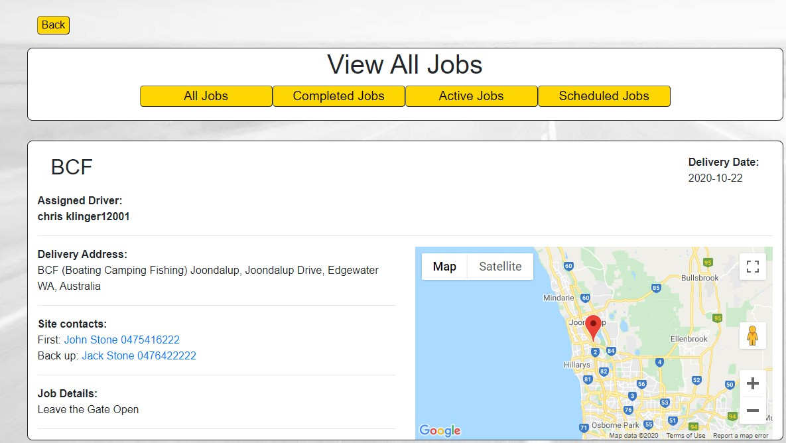
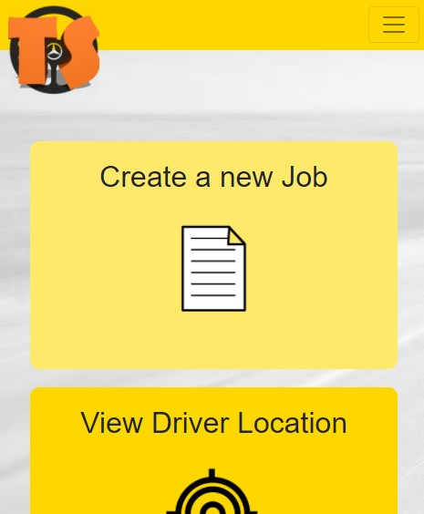

# Truck Safe&middot;  

## Deployed Site
https://safetrucking.herokuapp.com/

https://github.com/ChrisAMK/Top-Secret

## Description 
Truck safe is a React APP that makes use of Googles Developer Tools to create a Company focused Web Application for trucking and delivery companies to organise delieries. Management Users can create job listings and delegate them to avaliable drivers. Being a MERN Stack application, the data is stored on a database and retrieved when needed in the application. This Application's stand out feature is being able to track the live or last known location of a driver to ensure the driver is taking the appropriate breaks and is sticking to the speed limit, without the installation of any hardware. 

## Table of Contents 
* [Installation](#Installation)
* [Usage](#Usage)
* [License](#License)
* [Contributions](#Contributions)
* [Tests and Examples](#Tests)
* [Questions](#Questions)

## Installation  
There are no installation instructions as it is a Web Application, Simply Signup an Accout and log in

## Usage  
Truck Safe is intended to be used by companies that want to make the switch to digital job keeping, the trucking industry is very outdated and Truck Safe provides smaller companies and easy to use digital solution to keep all their data and operational information.

## License  
Academic Free License v3.0

[Click Here to go to License Site!](https://opensource.org/licenses/AFL-3.0)

## Tests and Examples  
As a Driver i need to Create and Account, sign in and update my details, i then wait for a manager to give me a job. Once i have a job i will be presented with the location of the job and the start button, once i reach my destination i press complete trip and the trip is recorded to the database. As a manager i create an account, sign in, i then create a new job, i assign it to a avaliable driver, then once the drive accepts his trip i can view his location in the Locate page

## Questions  
If there are any questions feel free to reach me at [Github](https://github.com/ChrisAMK)

or E-mail me at chriskl@live.com

